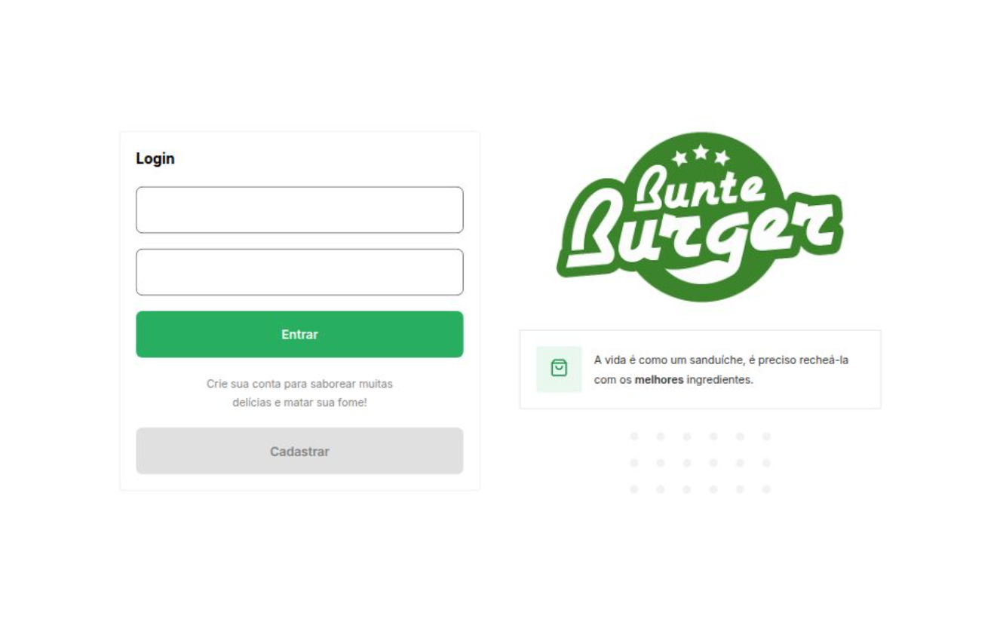

<h1 align="center">
  <strong>🍔 Hamburgueria</strong>
</h1>

<p align="center">
  <a href="https://burguer-typescript.vercel.app/">
    
  </a>
</p>

<p align="center">
  <a href="https://fast-burguer-bay.vercel.app/">🔗 Acesse o projeto em produção</a>
</p>

---

## 📖 Sobre o projeto

O **Hamburgueria** é um site desenvolvido com **React** e **TypeScript** para simular um sistema de cadastro, login, listagem de produtos e carrinho de compras. Idealizado para uma loja de hambúrgueres, o projeto conta com design responsivo, navegação intuitiva e usabilidade aprimorada com **Chakra UI**.

> ⚠️ A API de registro e login está temporariamente fora do ar.  
> 📦 Por isso, todos os dados são armazenados no **Local Storage** do navegador.

---

## 💡 Como utilizar

1. Acesse o site: [https://burguer-typescript.vercel.app/](https://burguer-typescript.vercel.app/)
2. Clique em **Cadastrar**
3. Preencha os dados solicitados
4. Após o cadastro, você será redirecionado para a tela de login
5. Realize o login com os mesmos dados
6. Explore os produtos e adicione itens ao carrinho!

---

## 🚀 Tecnologias utilizadas

| Tecnologia   | Descrição                              |
|--------------|----------------------------------------|
| React        | Biblioteca JavaScript para interfaces UI |
| TypeScript   | Superset de JavaScript tipado            |
| Vite         | Empacotador rápido para projetos front-end |
| Chakra UI    | Biblioteca de componentes estilizados    |
| React Icons  | Ícones vetoriais para React              |

---

## 📦 Como rodar localmente

### Pré-requisitos

- **Node.js** instalado – [Node.js](https://nodejs.org/)
- **Git** instalado – [Git](https://git-scm.com/)

### Passos

```bash
# Clone o repositório
git clone https://github.com/seu-usuario/hamburgueria-typescript.git

# Acesse o diretório do projeto
cd hamburgueria-typescript

# Instale as dependências
npm install

# Rode o servidor de desenvolvimento
npm run dev
